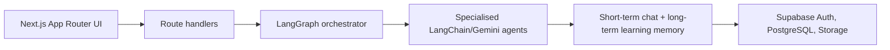

# AI Tutor — personalised multi-agent learning environment

A modular Next.js learning platform for B.Tech students. It turns a syllabus into structured notes, keeps tutor context, creates adaptive assessments, stores evidence, and generates mentor guidance from actual performance.

## Architecture

Agents have stable roles: `SYLLABUS_AGENT` normalises topics; `NOTES_AGENT` emits validated sections; `TUTOR_AGENT` uses recent chat; `ASSESSMENT_AGENT` creates validated questions; `PERFORMANCE_AGENT` is represented by persisted score aggregation and adaptive selection; `MENTOR_AGENT` grounds recommendations in those records. LangGraph routes each request to only the applicable agent.

## Stack
Next.js 15, TypeScript, Tailwind CSS, Lucide, Supabase Auth/PostgreSQL/Storage, Gemini via LangChain, LangGraph, and Zod.

## Setup
1. `cp .env.example .env.local` and fill all values.
2. Create a Supabase project and execute `database/schema.sql` in its SQL editor.
3. Configure Supabase Auth email/password and set redirect URLs for local and deployed app.
4. `npm install && npm run dev`.

Use a private `syllabus-images` bucket. Upload paths must start with the authenticated user UUID. Gemini calls are server-only.

## Main flows and API
- `POST /api/syllabus/analyze` validates and extracts a learning map.
- `POST /api/notes/generate` uses LangGraph, validates notes, and caches them by user/subject/topic.
- `POST /api/tutor/chat` persists a short chat context and reply.
- `POST /api/assessments/generate` chooses adaptive difficulty from performance.
- `POST /api/assessments/:id/submit` grades stored answers and updates topic records.
- `POST /api/mentor/analyse` writes an evidence-grounded recommendation.
- `GET/PATCH /api/preferences` stores presentation-only tutor and mentor names.

## Security and deployment
Middleware protects authenticated screens; APIs re-check user identity. RLS policies enforce ownership. Do not expose `GEMINI_API_KEY` or service-role credentials in the browser. Deploy to Vercel or any Node host after copying environment variables and running SQL migrations.

## Limitations and next steps
A configured Supabase/Gemini project is required for live AI and persistence. Syllabus image binary upload UI, full assessment runner/result UI, charts, and automated integration tests are the next production increments; the schema and secure storage bucket policy are included for them.
