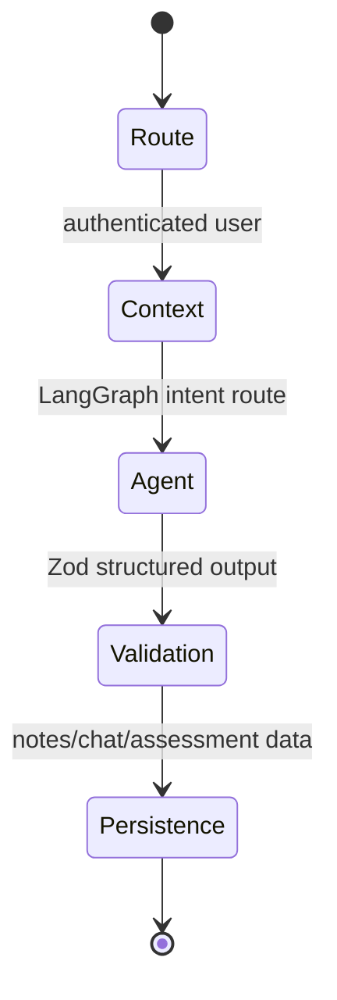

# Architecture and viva guide

## Request lifecycle

- **Next.js** provides a single typed frontend/API deployment and keeps secrets server-side.
- **Supabase** combines Auth, PostgreSQL, Storage, and RLS without a separate backend service.
- **Gemini** provides multimodal-capable generation; the current AI client is server-only and ready for image prompts.
- **LangChain** supplies Gemini model and structured-output integration.
- **LangGraph** makes routing explicit and keeps individual agent responsibility narrow.
- **PostgreSQL memory** separates raw `chat_messages` (short-term conversation) from selected `learning_memory`, performance rows, and recommendations (long-term learning data).

## Assessment loop

1. Generate questions for a topic at configured/adaptive difficulty.
2. Persist questions privately; never return correct answers to the learner view.
3. Submit answers; grade server-side and persist answers/attempt.
4. Upsert topic performance and choose next difficulty: below 50 easy, 50–79 medium, 80+ hard.
5. Ask the mentor only with stored performance evidence.

## Database ownership
Every user-specific top-level table carries `user_id`; Supabase RLS compares it to `auth.uid()`. Child records are reached through server APIs, preventing a client from querying arbitrary nested entities. Private syllabus objects are stored below `{userId}/...` and checked with a Storage policy.
